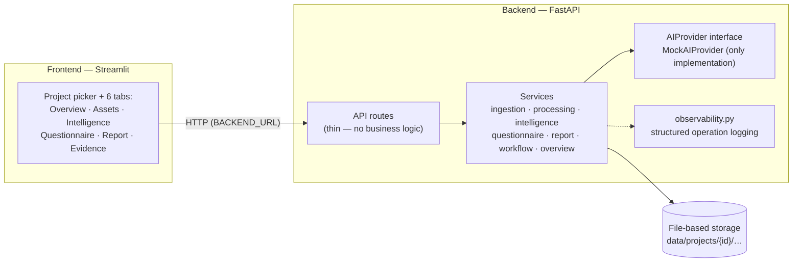
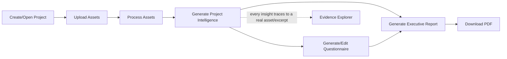

# Resonance — Multimodal Experience Intelligence

Resonance ingests multimodal feedback (documents, images, audio, video),
processes it per-asset, synthesizes cross-asset project intelligence with
full evidence traceability, and turns that into an editable follow-up
questionnaire and a downloadable executive PDF report — all through one
guided workflow.

**This is an independent, clean-room personal project.** It contains no
Bosch code, data, tooling, or proprietary material from any prior employer.
Every line here is original or built on open-source libraries with
compatible licenses.

**Current status: mock-mode by default, no live AI has been run yet.** All
AI-derived content produced so far (transcripts, image descriptions,
themes, sentiment, questionnaire questions, report summaries) comes from a
deterministic `MockAIProvider` — word-frequency counting and fixed keyword
lists, not a real model. A real `OpenAIProvider` adapter now exists behind
the same `AIProvider` interface (`AI_PROVIDER=openai`), but **no live
request has been made against a real OpenAI API key yet** — it's code-
complete and unit-tested with stubs only. `MockAIProvider` remains the
default; nothing changes unless you explicitly opt into `openai` mode and
supply your own key. See [Current limitations](#current-limitations) for
the exact line between what's real and what's mock/untested.

## What actually works today

- Upload TXT/PDF/JPG/PNG/MP3/WAV/MP4 files into a project
- Real, local (non-AI) technical metadata extraction per modality
- Per-asset processing into a `ProcessingResult` (PDF/TXT text extraction is
  genuinely real; audio transcription and image/vision description go
  through the pluggable `AIProvider` interface, currently `MockAIProvider`)
- Cross-asset `ProjectIntelligence` synthesis (themes, sentiment, pain
  points, positive signals, questions, opportunities, recommended actions)
  with every insight traceable back to a real asset/excerpt
- An editable follow-up `Questionnaire` generated from that intelligence
- An `ExecutiveReport` with deterministic risk/data-quality flags and a
  downloadable PDF
- One-click workflow orchestration that runs whichever pipeline steps are
  missing, safely and idempotently
- A project overview dashboard with a deterministic pipeline stage (never a
  fabricated progress percentage) and a next recommended action
- An Evidence Explorer for inspecting every generated insight's real source

## Supported modalities

| Modality | Extensions | Real/local processing | AI-dependent processing |
|---|---|---|---|
| Document | `.pdf`, `.txt` | Full text extraction (pypdf / charset-normalizer) | — |
| Image | `.jpg`, `.jpeg`, `.png` | Dimensions/format (Pillow) | OCR-like text + description (provider) |
| Audio | `.mp3`, `.wav` | Duration/sample rate/channels (mutagen) | Transcription (provider) |
| Video | `.mp4` | Duration/dimensions (hachoir); audio+keyframe extraction (ffmpeg) | Transcription + per-frame description (provider) |

"Provider" is `MockAIProvider` by default; `OpenAIProvider` exists behind
the same interface (`AI_PROVIDER=openai`) but has not been live-tested —
see [Current limitations](#current-limitations).

## Architecture



Backend is modular FastAPI under `backend/app/`: `api/` (thin route
modules), `core/` (settings, observability), `models/` (pydantic data
shapes — no ORM, no database), `services/` (all business logic and
file-based persistence). Frontend is a single Streamlit app that only talks
to the backend over HTTP — no shared imports. Full conventions are
documented in `CLAUDE.md`; exact per-phase implementation detail is in
`docs/BUILD_STATUS.md`.

## End-to-end workflow



A "Run Remaining Pipeline" button executes whichever of these steps are
still missing, in one call — safe to click repeatedly (see
[Idempotency](#idempotency--evidence-traceability)). Individual controls
for each step remain available in their respective tabs for manual
control/inspection.

## Evidence traceability — the core differentiator

Every generated insight (a theme, a pain point, a questionnaire question, a
line in the executive report) carries an `EvidenceItem`: category,
statement, `asset_id`, `processing_result_id`, source filename, and — where
available — a verbatim excerpt from that asset's own processed text.
**Nothing is invented**: the synthesis provider is only allowed to cite
excerpts that are real substrings of the actual asset content passed to it,
and the consolidation service defensively drops any evidence that doesn't
reference a real id from that input set before persisting it. A dedicated
`evidence_integrity` check (used by both the automated tests and the
evaluation harness) independently verifies that every persisted evidence
item's `asset_id`/`processing_result_id`/filename really exist and match —
see `backend/app/services/evidence_integrity.py`.

The Evidence Explorer tab lets you filter and inspect every evidence item
for a project by category, source filename, or asset — reading only
already-stored evidence, never re-deriving or fabricating a snippet.

## Idempotency & evidence traceability

- Processing results, project intelligence, questionnaires, and reports
  all use **deterministic ids** (`uuid5` of their inputs), so regenerating
  any of them overwrites the previous record instead of accumulating
  duplicates.
- The workflow orchestrator additionally **skips** regenerating a
  questionnaire once one exists for the current intelligence, specifically
  so a manual edit is never silently discarded by clicking "Run Remaining
  Pipeline" again.
- Full detail: `CLAUDE.md`'s "Architecture conventions" section.

## Running locally

```bash
python -m venv .venv
.venv\Scripts\activate        # Windows; `source .venv/bin/activate` on macOS/Linux
pip install -r requirements.txt
copy .env.example .env        # macOS/Linux: cp .env.example .env
```

**Backend:**

```bash
uvicorn app.main:app --app-dir backend --reload --port 8000
```

**Frontend** (separate terminal):

```bash
streamlit run frontend/app.py
```

Backend health check: <http://localhost:8000/health> · readiness/capability
report: <http://localhost:8000/ready>.

### Using the real OpenAI provider (optional, untested against a live key)

`AI_PROVIDER=mock` is the default and needs nothing further. To try the
real `OpenAIProvider` adapter, set in `.env`:

```
AI_PROVIDER=openai
OPENAI_API_KEY=sk-...           # your own key — never commit this
OPENAI_TEXT_MODEL=...           # e.g. a current GPT model; not hardcoded in code
OPENAI_TRANSCRIBE_MODEL=...     # e.g. a current transcription model
```

`GET /ready` will report `ai_provider_configured: false` (HTTP 503) with a
clear message if any of these are missing, without making any API call.
**This adapter has not yet been exercised against a real OpenAI account in
this project** — only unit-tested with stubs (see
`backend/tests/test_openai_provider.py`). Use it at your own discretion and
cost.

## Running the evaluation harness

A small, reproducible **engineering/pipeline** evaluation (not an AI-quality
benchmark) that exercises the full workflow against synthetic fixtures in a
disposable temp project:

```bash
.venv\Scripts\python.exe scripts\evaluate.py
```

Always runs against `MockAIProvider`. See `evaluation/README.md` for
exactly what it measures (files ingested/processed, workflow completion,
evidence integrity, idempotency, questionnaire-edit preservation, PDF
generation, latency) and what it explicitly does **not** claim (semantic
accuracy, transcription/vision quality — those require a live run against
a real provider, which has not been done yet even though `OpenAIProvider`
code now exists).

## Running the automated tests

```bash
.venv\Scripts\python.exe -m pytest backend/tests -v
```

A focused regression suite (not a push for coverage) covering upload
validation, path-traversal safety, project isolation, processing failure
isolation, workflow idempotency, evidence integrity, questionnaire-edit
preservation, report/PDF generation, and (since P1.2) `OpenAIProvider`'s
configuration handling and request/response mapping via stubs — no test in
this suite ever makes a real network call.

## Current limitations

- **All AI-derived content produced so far is `MockAIProvider` output** —
  deterministic keyword/word-frequency heuristics, not real transcription,
  vision, or language understanding. Every mock-derived string is labeled
  `[mock]` in the data itself, and the UI/reports flag this explicitly
  (`mock_provider_output` risk flag on every report). A real
  `OpenAIProvider` exists (`AI_PROVIDER=openai`) but **has not been
  live-tested against a real API key** — do not treat its presence in the
  codebase as evidence of real-AI validation.
- No database — file-based JSON persistence under `data/`, which must live
  on a durable filesystem/volume in any real deployment (see
  `docs/DEPLOYMENT.md`).
- No authentication, no multi-user support.
- No cloud deployment (this repo has never been deployed — see
  `docs/DEPLOYMENT.md` for what's prepared vs. not).
- No embeddings/vector search/RAG.
- Video technical-metadata extraction depends on `hachoir`, which one
  development machine's corporate package mirror couldn't resolve; video
  processing itself was validated earlier on another machine and the code
  path is unchanged — this is an environment limitation, not a code defect.
- Single synchronous orchestration call — no background job queue, so a
  project with many never-processed assets makes "Run Remaining Pipeline"
  take proportionally longer.

## Next production steps

Real AI provider integration (behind the existing `AIProvider` interface —
see `backend/app/services/ai_providers/base.py`), a persistent
database/object-storage backend, authentication, and an actual cloud
deployment — all deliberately deferred, tracked in `CLAUDE.md`'s
"High-level future phases."

## Project docs

- `CLAUDE.md` — architecture conventions, coding rules, phase history
- `docs/BUILD_STATUS.md` — exact per-phase implementation detail
- `docs/DEPLOYMENT.md` — deployment readiness (not a deployment)
- `evaluation/README.md` — evaluation harness design and scope
